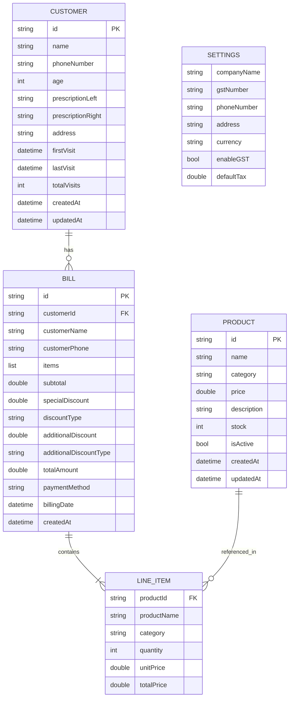

# Design Document

## Overview

The Flutter Optical Shop Management System is a serverless, offline-first mobile application built using Flutter 3.10+ targeting Android and iOS platforms. The application uses local storage (Hive or Sqflite) for all data persistence, eliminating the need for backend servers or internet connectivity. The design emphasizes a warm, humanized user interface with eyewear-themed visual elements, smooth animations, and optimized data handling algorithms.

### Design Principles

1. **Offline-First**: All functionality works without internet connectivity
2. **Performance**: Sub-second response times for all user interactions
3. **Humanized UI**: Warm colors, rounded shapes, and delightful micro-interactions
4. **Eyewear Theme**: Visual elements inspired by optical frames and lenses
5. **Data Integrity**: Robust validation and error handling at all layers

## Architecture

### High-Level Architecture

```
┌─────────────────────────────────────────────────┐
│           Presentation Layer (UI)               │
│  ┌──────────┐ ┌──────────┐ ┌──────────┐       │
│  │Dashboard │ │Customers │ │  Bills   │ ...   │
│  └──────────┘ └──────────┘ └──────────┘       │
└─────────────────────────────────────────────────┘
                      ↓
┌─────────────────────────────────────────────────┐
│          Business Logic Layer                   │
│  ┌──────────────┐ ┌──────────────┐            │
│  │ State Mgmt   │ │  Validators  │            │
│  │ (Provider)   │ │              │            │
│  └──────────────┘ └──────────────┘            │
└─────────────────────────────────────────────────┘
                      ↓
┌─────────────────────────────────────────────────┐
│           Data Access Layer                     │
│  ┌──────────────┐ ┌──────────────┐            │
│  │  Services    │ │    Models    │            │
│  │              │ │              │            │
│  └──────────────┘ └──────────────┘            │
└─────────────────────────────────────────────────┘
                      ↓
┌─────────────────────────────────────────────────┐
│         Local Storage (Hive/Sqflite)            │
│  customers | bills | products | settings       │
└─────────────────────────────────────────────────┘
```


### Technology Stack

- **Framework**: Flutter 3.10+
- **Language**: Dart 3.0+
- **Local Database**: Hive (primary choice for lightweight, fast NoSQL storage)
- **State Management**: Provider (simple, efficient, officially recommended)
- **Navigation**: GoRouter (declarative routing with deep linking support)
- **Animations**: Flutter's built-in animation framework
- **UUID Generation**: uuid package
- **Date Handling**: intl package

### Database Choice: Hive

**Rationale for Hive over Sqflite:**
- Faster read/write operations (no SQL parsing overhead)
- Type-safe with code generation
- Simpler API for CRUD operations
- Better performance for small to medium datasets (< 100k records)
- Lazy loading support
- Built-in encryption support for future enhancements

## Components and Interfaces

### 1. Data Models

#### Customer Model
```dart
@HiveType(typeId: 0)
class Customer extends HiveObject {
  @HiveField(0)
  late String id;
  
  @HiveField(1)
  late String name;
  
  @HiveField(2)
  late String phoneNumber;
  
  @HiveField(3)
  late int age;
  
  @HiveField(4)
  String? prescriptionLeft;
  
  @HiveField(5)
  String? prescriptionRight;
  
  @HiveField(6)
  String? address;
  
  @HiveField(7)
  late DateTime firstVisit;
  
  @HiveField(8)
  late DateTime lastVisit;
  
  @HiveField(9)
  late int totalVisits;
  
  @HiveField(10)
  late DateTime createdAt;
  
  @HiveField(11)
  late DateTime updatedAt;
}
```


#### Bill Model
```dart
@HiveType(typeId: 1)
class Bill extends HiveObject {
  @HiveField(0)
  late String id;
  
  @HiveField(1)
  late String customerId;
  
  @HiveField(2)
  late String customerName;
  
  @HiveField(3)
  late String customerPhone;
  
  @HiveField(4)
  late List<LineItem> items;
  
  @HiveField(5)
  late double subtotal;
  
  @HiveField(6)
  late double specialDiscount;
  
  @HiveField(7)
  late String discountType;
  
  @HiveField(8)
  late double additionalDiscount;
  
  @HiveField(9)
  late String additionalDiscountType;
  
  @HiveField(10)
  late double totalAmount;
  
  @HiveField(11)
  late String paymentMethod;
  
  @HiveField(12)
  late DateTime billingDate;
  
  @HiveField(13)
  late DateTime createdAt;
}

@HiveType(typeId: 2)
class LineItem {
  @HiveField(0)
  late String productId;
  
  @HiveField(1)
  late String productName;
  
  @HiveField(2)
  late String category;
  
  @HiveField(3)
  late int quantity;
  
  @HiveField(4)
  late double unitPrice;
  
  @HiveField(5)
  late double totalPrice;
}
```

#### Product Model
```dart
@HiveType(typeId: 3)
class Product extends HiveObject {
  @HiveField(0)
  late String id;
  
  @HiveField(1)
  late String name;
  
  @HiveField(2)
  late String category;
  
  @HiveField(3)
  late double price;
  
  @HiveField(4)
  String? description;
  
  @HiveField(5)
  late int stock;
  
  @HiveField(6)
  late bool isActive;
  
  @HiveField(7)
  late DateTime createdAt;
  
  @HiveField(8)
  late DateTime updatedAt;
}
```

#### Settings Model
```dart
@HiveType(typeId: 4)
class Settings extends HiveObject {
  @HiveField(0)
  late String companyName;
  
  @HiveField(1)
  String? gstNumber;
  
  @HiveField(2)
  late String phoneNumber;
  
  @HiveField(3)
  String? address;
  
  @HiveField(4)
  late String currency;
  
  @HiveField(5)
  late bool enableGST;
  
  @HiveField(6)
  late double defaultTax;
}
```


### 2. Service Layer

#### Database Service Interface
```dart
abstract class DatabaseService<T> {
  Future<void> initialize();
  Future<String> create(T item);
  Future<T?> read(String id);
  Future<List<T>> readAll();
  Future<void> update(String id, T item);
  Future<void> delete(String id);
  Future<List<T>> search(String query);
}
```

#### Customer Service
```dart
class CustomerService implements DatabaseService<Customer> {
  late Box<Customer> _box;
  
  // CRUD operations
  Future<String> create(Customer customer);
  Future<Customer?> read(String id);
  Future<List<Customer>> readAll();
  Future<void> update(String id, Customer customer);
  Future<void> delete(String id);
  
  // Custom queries
  Future<List<Customer>> search(String query);
  Future<List<Customer>> getRecentCustomers(int days);
  Future<List<Customer>> getCustomersByDateRange(DateTime start, DateTime end);
  Future<void> incrementVisitCount(String customerId);
}
```

#### Bill Service
```dart
class BillService implements DatabaseService<Bill> {
  late Box<Bill> _box;
  
  // CRUD operations
  Future<String> create(Bill bill);
  Future<Bill?> read(String id);
  Future<List<Bill>> readAll();
  Future<void> update(String id, Bill bill);
  Future<void> delete(String id);
  
  // Custom queries
  Future<List<Bill>> search(String query);
  Future<List<Bill>> getBillsByDate(DateTime date);
  Future<List<Bill>> getBillsByDateRange(DateTime start, DateTime end);
  Future<double> getTotalRevenue(DateTime start, DateTime end);
  Future<int> getBillCount(DateTime start, DateTime end);
  
  // Business logic
  double calculateBillTotal(Bill bill);
}
```

#### Product Service
```dart
class ProductService implements DatabaseService<Product> {
  late Box<Product> _box;
  
  // CRUD operations
  Future<String> create(Product product);
  Future<Product?> read(String id);
  Future<List<Product>> readAll();
  Future<void> update(String id, Product product);
  Future<void> delete(String id);
  
  // Custom queries
  Future<List<Product>> search(String query);
  Future<List<Product>> getProductsByCategory(String category);
  Future<List<Product>> getActiveProducts();
}
```

#### Settings Service
```dart
class SettingsService {
  late Box<Settings> _box;
  
  Future<Settings> getSettings();
  Future<void> updateSettings(Settings settings);
  Future<void> resetToDefaults();
}
```


### 3. State Management Architecture

Using Provider pattern for state management:

```dart
// Customer Provider
class CustomerProvider extends ChangeNotifier {
  final CustomerService _service;
  List<Customer> _customers = [];
  bool _isLoading = false;
  String? _error;
  
  List<Customer> get customers => _customers;
  bool get isLoading => _isLoading;
  String? get error => _error;
  
  Future<void> loadCustomers();
  Future<void> addCustomer(Customer customer);
  Future<void> updateCustomer(String id, Customer customer);
  Future<void> deleteCustomer(String id);
  Future<List<Customer>> searchCustomers(String query);
}

// Bill Provider
class BillProvider extends ChangeNotifier {
  final BillService _service;
  List<Bill> _bills = [];
  Bill? _currentBill;
  bool _isLoading = false;
  
  List<Bill> get bills => _bills;
  Bill? get currentBill => _currentBill;
  
  Future<void> loadBills();
  Future<void> createBill(Bill bill);
  Future<void> deleteBill(String id);
  void startNewBill(Customer customer);
  void addLineItem(Product product, int quantity);
  void removeLineItem(int index);
  void updateQuantity(int index, int quantity);
  void applySpecialDiscount(double amount, String type);
  void applyAdditionalDiscount(double amount, String type);
  double calculateTotal();
}

// Product Provider
class ProductProvider extends ChangeNotifier {
  final ProductService _service;
  List<Product> _products = [];
  String _selectedCategory = 'All';
  
  List<Product> get products => _filteredProducts();
  
  Future<void> loadProducts();
  Future<void> addProduct(Product product);
  Future<void> updateProduct(String id, Product product);
  Future<void> toggleProductActive(String id);
  void setCategory(String category);
  List<Product> _filteredProducts();
}

// Dashboard Provider
class DashboardProvider extends ChangeNotifier {
  final BillService _billService;
  final CustomerService _customerService;
  
  double _totalRevenue = 0;
  int _customersToday = 0;
  int _totalSales = 0;
  double _monthlyRevenue = 0;
  
  Future<void> loadDashboardData();
  Future<void> refresh();
}
```


### 4. Navigation Structure

Using GoRouter for declarative navigation:

```dart
final router = GoRouter(
  routes: [
    ShellRoute(
      builder: (context, state, child) => MainScaffold(child: child),
      routes: [
        GoRoute(
          path: '/',
          name: 'dashboard',
          builder: (context, state) => DashboardScreen(),
        ),
        GoRoute(
          path: '/customers',
          name: 'customers',
          builder: (context, state) => CustomersScreen(),
          routes: [
            GoRoute(
              path: 'add',
              name: 'add-customer',
              builder: (context, state) => AddEditCustomerScreen(),
            ),
            GoRoute(
              path: ':id/edit',
              name: 'edit-customer',
              builder: (context, state) => AddEditCustomerScreen(
                customerId: state.params['id'],
              ),
            ),
          ],
        ),
        GoRoute(
          path: '/bills',
          name: 'bills',
          builder: (context, state) => BillsScreen(),
          routes: [
            GoRoute(
              path: 'create',
              name: 'create-bill',
              builder: (context, state) => CreateBillFlow(),
            ),
            GoRoute(
              path: ':id',
              name: 'bill-detail',
              builder: (context, state) => BillDetailScreen(
                billId: state.params['id']!,
              ),
            ),
          ],
        ),
        GoRoute(
          path: '/products',
          name: 'products',
          builder: (context, state) => ProductsScreen(),
          routes: [
            GoRoute(
              path: 'add',
              name: 'add-product',
              builder: (context, state) => AddEditProductScreen(),
            ),
            GoRoute(
              path: ':id/edit',
              name: 'edit-product',
              builder: (context, state) => AddEditProductScreen(
                productId: state.params['id'],
              ),
            ),
          ],
        ),
        GoRoute(
          path: '/settings',
          name: 'settings',
          builder: (context, state) => SettingsScreen(),
        ),
      ],
    ),
  ],
);
```


### 5. UI Component Architecture

#### Reusable Widgets

**StatCard Widget**
```dart
class StatCard extends StatelessWidget {
  final String title;
  final String value;
  final IconData icon;
  final Color color;
  final VoidCallback? onTap;
  
  // Displays animated statistics with glassmorphism effect
}
```

**CustomerTile Widget**
```dart
class CustomerTile extends StatelessWidget {
  final Customer customer;
  final VoidCallback? onTap;
  final VoidCallback? onDelete;
  
  // Shows customer info with avatar, name, phone, visits
}
```

**BillTile Widget**
```dart
class BillTile extends StatelessWidget {
  final Bill bill;
  final VoidCallback? onTap;
  
  // Displays bill summary with color-coded payment method
}
```

**ProductCard Widget**
```dart
class ProductCard extends StatelessWidget {
  final Product product;
  final VoidCallback? onEdit;
  final VoidCallback? onToggleActive;
  final VoidCallback? onAddToCart;
  
  // Shows product with category badge and action buttons
}
```

**CustomTextField Widget**
```dart
class CustomTextField extends StatelessWidget {
  final String label;
  final String? hint;
  final TextEditingController controller;
  final String? Function(String?)? validator;
  final TextInputType? keyboardType;
  final int? maxLines;
  
  // Themed text field with validation and error display
}
```

**AnimatedCounter Widget**
```dart
class AnimatedCounter extends StatefulWidget {
  final double value;
  final Duration duration;
  final String prefix;
  final String suffix;
  
  // Animates number counting from 0 to value
}
```


## Data Models

### Database Schema

**Hive Boxes:**
- `customers` - Box<Customer>
- `bills` - Box<Bill>
- `products` - Box<Product>
- `settings` - Box<Settings> (single entry)

### Data Relationships



### Data Denormalization Strategy

To optimize read performance, customer information is denormalized in bills:
- `customerName` and `customerPhone` are stored directly in Bill records
- This eliminates the need for joins when displaying bill lists
- Trade-off: Customer updates don't retroactively update historical bills (acceptable for billing records)


## Error Handling

### Error Handling Strategy

#### 1. Database Errors
```dart
class DatabaseException implements Exception {
  final String message;
  final dynamic originalError;
  
  DatabaseException(this.message, [this.originalError]);
}

// Usage in services
try {
  await _box.put(id, customer);
} catch (e) {
  throw DatabaseException('Failed to save customer', e);
}
```

#### 2. Validation Errors
```dart
class ValidationException implements Exception {
  final Map<String, String> errors;
  
  ValidationException(this.errors);
}

// Validator class
class Validators {
  static String? validateName(String? value) {
    if (value == null || value.isEmpty) {
      return 'Name is required';
    }
    if (value.length < 2 || value.length > 50) {
      return 'Name must be between 2 and 50 characters';
    }
    if (!RegExp(r'^[a-zA-Z\s]+$').hasMatch(value)) {
      return 'Name can only contain letters and spaces';
    }
    return null;
  }
  
  static String? validatePhone(String? value) {
    if (value == null || value.isEmpty) {
      return 'Phone number is required';
    }
    if (!RegExp(r'^\d{10}$').hasMatch(value)) {
      return 'Phone number must be exactly 10 digits';
    }
    return null;
  }
  
  static String? validateAge(String? value) {
    if (value == null || value.isEmpty) {
      return 'Age is required';
    }
    final age = int.tryParse(value);
    if (age == null || age < 1 || age > 120) {
      return 'Age must be between 1 and 120';
    }
    return null;
  }
  
  static String? validatePrice(String? value) {
    if (value == null || value.isEmpty) {
      return 'Price is required';
    }
    final price = double.tryParse(value);
    if (price == null || price <= 0) {
      return 'Price must be greater than 0';
    }
    return null;
  }
}
```

#### 3. User-Facing Error Messages
```dart
class ErrorHandler {
  static void showError(BuildContext context, dynamic error) {
    String message;
    
    if (error is DatabaseException) {
      message = 'Oops! Unable to save. Please try again.';
    } else if (error is ValidationException) {
      message = error.errors.values.first;
    } else {
      message = 'An unexpected error occurred. Please try again.';
    }
    
    ScaffoldMessenger.of(context).showSnackBar(
      SnackBar(
        content: Text(message),
        backgroundColor: Colors.red,
        behavior: SnackBarBehavior.floating,
      ),
    );
  }
  
  static void showSuccess(BuildContext context, String message) {
    ScaffoldMessenger.of(context).showSnackBar(
      SnackBar(
        content: Text(message),
        backgroundColor: Color(0xFF14b8a6),
        behavior: SnackBarBehavior.floating,
      ),
    );
  }
}
```

#### 4. Graceful Degradation
- Empty states with friendly illustrations and action prompts
- Fallback values for missing data
- Retry mechanisms for failed operations
- Offline indicators (though app is offline-first)


## Testing Strategy

### 1. Unit Tests

**Model Tests**
- Test data serialization/deserialization
- Test model validation logic
- Test calculated fields

**Service Tests**
- Mock Hive boxes for isolated testing
- Test CRUD operations
- Test search and filter logic
- Test business logic (bill calculations)

**Validator Tests**
- Test all validation rules
- Test edge cases (empty, null, boundary values)

**Example:**
```dart
void main() {
  group('Validators', () {
    test('validatePhone accepts valid 10-digit number', () {
      expect(Validators.validatePhone('9876543210'), null);
    });
    
    test('validatePhone rejects invalid formats', () {
      expect(Validators.validatePhone('123'), isNotNull);
      expect(Validators.validatePhone('abcd123456'), isNotNull);
      expect(Validators.validatePhone(''), isNotNull);
    });
  });
  
  group('BillService', () {
    late BillService service;
    
    setUp(() {
      // Initialize with mock box
      service = BillService();
    });
    
    test('calculateBillTotal applies discounts correctly', () {
      final bill = Bill()
        ..subtotal = 1000
        ..specialDiscount = 10
        ..discountType = 'percentage'
        ..additionalDiscount = 50
        ..additionalDiscountType = 'fixed';
      
      final total = service.calculateBillTotal(bill);
      expect(total, 850); // 1000 - 10% = 900, 900 - 50 = 850
    });
  });
}
```

### 2. Widget Tests

**Component Tests**
- Test individual widgets render correctly
- Test user interactions (taps, text input)
- Test state changes

**Example:**
```dart
void main() {
  testWidgets('CustomerTile displays customer information', (tester) async {
    final customer = Customer()
      ..name = 'John Doe'
      ..phoneNumber = '9876543210'
      ..totalVisits = 5;
    
    await tester.pumpWidget(
      MaterialApp(
        home: Scaffold(
          body: CustomerTile(customer: customer),
        ),
      ),
    );
    
    expect(find.text('John Doe'), findsOneWidget);
    expect(find.text('9876543210'), findsOneWidget);
    expect(find.text('5'), findsOneWidget);
  });
}
```

### 3. Integration Tests

**Flow Tests**
- Test complete user workflows (create bill end-to-end)
- Test navigation between screens
- Test data persistence

**Example:**
```dart
void main() {
  testWidgets('Complete bill creation flow', (tester) async {
    await tester.pumpWidget(MyApp());
    
    // Navigate to bills screen
    await tester.tap(find.byIcon(Icons.receipt));
    await tester.pumpAndSettle();
    
    // Tap create bill FAB
    await tester.tap(find.byType(FloatingActionButton));
    await tester.pumpAndSettle();
    
    // Select customer
    await tester.tap(find.text('John Doe'));
    await tester.pumpAndSettle();
    
    // Add product
    await tester.tap(find.text('Eye Test'));
    await tester.pumpAndSettle();
    
    // Complete bill
    await tester.tap(find.text('Complete Bill'));
    await tester.pumpAndSettle();
    
    // Verify success
    expect(find.text('Bill created successfully'), findsOneWidget);
  });
}
```

### 4. Performance Tests

**Benchmarks**
- Measure database query times with large datasets
- Test list scrolling performance with 1000+ items
- Measure app startup time
- Test animation frame rates


## UI/UX Design Specifications

### Theme Configuration

```dart
class AppTheme {
  // Colors
  static const primaryColor = Color(0xFF1a365d); // Deep navy blue
  static const accentColor = Color(0xFFf59e0b); // Warm amber/gold
  static const backgroundColor = Color(0xFFfaf9f6); // Soft cream
  static const textColor = Color(0xFF2d3748); // Charcoal gray
  static const successColor = Color(0xFF14b8a6); // Teal green
  static const errorColor = Color(0xFFef4444); // Red
  
  // Typography
  static const headingFont = 'Poppins';
  static const bodyFont = 'Inter';
  
  // Spacing
  static const spacing4 = 4.0;
  static const spacing8 = 8.0;
  static const spacing12 = 12.0;
  static const spacing16 = 16.0;
  static const spacing24 = 24.0;
  static const spacing32 = 32.0;
  
  // Border Radius
  static const radiusSmall = 8.0;
  static const radiusMedium = 16.0;
  static const radiusLarge = 24.0;
  
  static ThemeData get lightTheme {
    return ThemeData(
      primaryColor: primaryColor,
      scaffoldBackgroundColor: backgroundColor,
      colorScheme: ColorScheme.light(
        primary: primaryColor,
        secondary: accentColor,
        surface: Colors.white,
        error: errorColor,
      ),
      textTheme: TextTheme(
        displayLarge: TextStyle(
          fontFamily: headingFont,
          fontSize: 32,
          fontWeight: FontWeight.bold,
          color: textColor,
        ),
        displayMedium: TextStyle(
          fontFamily: headingFont,
          fontSize: 24,
          fontWeight: FontWeight.bold,
          color: textColor,
        ),
        bodyLarge: TextStyle(
          fontFamily: bodyFont,
          fontSize: 16,
          color: textColor,
        ),
        bodyMedium: TextStyle(
          fontFamily: bodyFont,
          fontSize: 14,
          color: textColor,
        ),
      ),
      cardTheme: CardTheme(
        elevation: 2,
        shape: RoundedRectangleBorder(
          borderRadius: BorderRadius.circular(radiusMedium),
        ),
      ),
      inputDecorationTheme: InputDecorationTheme(
        border: OutlineInputBorder(
          borderRadius: BorderRadius.circular(radiusSmall),
        ),
        filled: true,
        fillColor: Colors.white,
      ),
      floatingActionButtonTheme: FloatingActionButtonThemeData(
        backgroundColor: accentColor,
        foregroundColor: Colors.white,
      ),
    );
  }
}
```

### Animation Specifications

#### Page Transitions
```dart
class SlidePageRoute<T> extends PageRouteBuilder<T> {
  final Widget page;
  
  SlidePageRoute({required this.page})
      : super(
          pageBuilder: (context, animation, secondaryAnimation) => page,
          transitionDuration: Duration(milliseconds: 300),
          transitionsBuilder: (context, animation, secondaryAnimation, child) {
            const begin = Offset(1.0, 0.0);
            const end = Offset.zero;
            const curve = Curves.easeInOutCubic;
            
            var tween = Tween(begin: begin, end: end)
                .chain(CurveTween(curve: curve));
            var offsetAnimation = animation.drive(tween);
            
            return SlideTransition(
              position: offsetAnimation,
              child: FadeTransition(
                opacity: animation,
                child: child,
              ),
            );
          },
        );
}
```

#### Staggered List Animation
```dart
class StaggeredListView extends StatefulWidget {
  final List<Widget> children;
  final Duration staggerDelay;
  
  const StaggeredListView({
    required this.children,
    this.staggerDelay = const Duration(milliseconds: 200),
  });
  
  @override
  State<StaggeredListView> createState() => _StaggeredListViewState();
}

class _StaggeredListViewState extends State<StaggeredListView>
    with SingleTickerProviderStateMixin {
  late AnimationController _controller;
  
  @override
  void initState() {
    super.initState();
    _controller = AnimationController(
      vsync: this,
      duration: Duration(
        milliseconds: 300 + (widget.children.length * 200),
      ),
    );
    _controller.forward();
  }
  
  @override
  Widget build(BuildContext context) {
    return ListView.builder(
      itemCount: widget.children.length,
      itemBuilder: (context, index) {
        final delay = index * 0.1;
        final animation = Tween<double>(begin: 0, end: 1).animate(
          CurvedAnimation(
            parent: _controller,
            curve: Interval(
              delay,
              delay + 0.3,
              curve: Curves.easeOut,
            ),
          ),
        );
        
        return FadeTransition(
          opacity: animation,
          child: SlideTransition(
            position: Tween<Offset>(
              begin: Offset(0.3, 0),
              end: Offset.zero,
            ).animate(animation),
            child: widget.children[index],
          ),
        );
      },
    );
  }
}
```

#### Micro-interactions
```dart
class TapScaleButton extends StatefulWidget {
  final Widget child;
  final VoidCallback onTap;
  
  const TapScaleButton({required this.child, required this.onTap});
  
  @override
  State<TapScaleButton> createState() => _TapScaleButtonState();
}

class _TapScaleButtonState extends State<TapScaleButton>
    with SingleTickerProviderStateMixin {
  late AnimationController _controller;
  late Animation<double> _scaleAnimation;
  
  @override
  void initState() {
    super.initState();
    _controller = AnimationController(
      vsync: this,
      duration: Duration(milliseconds: 100),
    );
    _scaleAnimation = Tween<double>(begin: 1.0, end: 0.95).animate(
      CurvedAnimation(parent: _controller, curve: Curves.easeInOut),
    );
  }
  
  @override
  Widget build(BuildContext context) {
    return GestureDetector(
      onTapDown: (_) => _controller.forward(),
      onTapUp: (_) {
        _controller.reverse();
        widget.onTap();
      },
      onTapCancel: () => _controller.reverse(),
      child: ScaleTransition(
        scale: _scaleAnimation,
        child: widget.child,
      ),
    );
  }
}
```


### Screen Layouts

#### Dashboard Screen Layout
```
┌─────────────────────────────────────┐
│  ☰  Optical Shop         ⚙️         │ App Bar
├─────────────────────────────────────┤
│                                     │
│  Good Morning, [Shop Name]          │ Greeting
│                                     │
├─────────────────────────────────────┤
│  ┌──────────┐  ┌──────────┐        │
│  │ ₹50,000  │  │    25    │        │ Stats Row
│  │ Revenue  │  │Customers │        │ (Horizontal Scroll)
│  └──────────┘  └──────────┘        │
│  ┌──────────┐  ┌──────────┐        │
│  │    15    │  │ ₹150,000 │        │
│  │  Sales   │  │ Monthly  │        │
│  └──────────┘  └──────────┘        │
├─────────────────────────────────────┤
│                                     │
│  Revenue Trend (Chart)              │ Chart Section
│  ┌─────────────────────────────┐   │
│  │     📊 Line/Bar Chart       │   │
│  └─────────────────────────────┘   │
│                                     │
└─────────────────────────────────────┘
│  🏠  👥  🧾  📦  ⚙️                 │ Bottom Nav
└─────────────────────────────────────┘
```

#### Customers Screen Layout
```
┌─────────────────────────────────────┐
│  ← Customers                        │ App Bar
├─────────────────────────────────────┤
│  🔍 Search by name or phone...      │ Search Bar
├─────────────────────────────────────┤
│  [All] [Recent] [This Month]        │ Filter Chips
├─────────────────────────────────────┤
│  ┌─────────────────────────────┐   │
│  │ JD  John Doe                │   │ Customer Tile
│  │     9876543210              │   │
│  │     Last visit: 2 days ago  │   │
│  │                         5 → │   │
│  └─────────────────────────────┘   │
│  ┌─────────────────────────────┐   │
│  │ AS  Alice Smith             │   │
│  │     9123456789              │   │
│  │     Last visit: 1 week ago  │   │
│  │                         3 → │   │
│  └─────────────────────────────┘   │
│                                     │
│                              [+]    │ FAB
└─────────────────────────────────────┘
```

#### Create Bill Flow Layout

**Step 1: Customer Selection**
```
┌─────────────────────────────────────┐
│  ← Select Customer                  │
├─────────────────────────────────────┤
│  [+ Add New Customer]               │
├─────────────────────────────────────┤
│  🔍 Search customers...             │
├─────────────────────────────────────┤
│  ┌─────────────────────────────┐   │
│  │ JD  John Doe                │   │
│  │     9876543210              │   │
│  │     5 visits  Last: 2d ago  │   │
│  │                         🗑️  │   │
│  └─────────────────────────────┘   │
│  ┌─────────────────────────────┐   │
│  │ AS  Alice Smith             │   │
│  │     9123456789              │   │
│  │     3 visits  Last: 1w ago  │   │
│  │                         🗑️  │   │
│  └─────────────────────────────┘   │
└─────────────────────────────────────┘
```

**Step 2: Product Selection**
```
┌─────────────────────────────────────┐
│  ← Add Products                     │
├─────────────────────────────────────┤
│  [Service] [Frame] [Lens]           │ Category Tabs
├─────────────────────────────────────┤
│  ┌─────────────────────────────┐   │
│  │ Eye Test            ₹500    │   │
│  │                         [+] │   │
│  └─────────────────────────────┘   │
│  ┌─────────────────────────────┐   │
│  │ Contact Lens Fit    ₹300    │   │
│  │                         [+] │   │
│  └─────────────────────────────┘   │
├─────────────────────────────────────┤
│  Cart: 2 items              ₹800    │ Cart Summary
│  [Next]                             │
└─────────────────────────────────────┘
```

**Step 3: Billing Details**
```
┌─────────────────────────────────────┐
│  ← Billing Details                  │
├─────────────────────────────────────┤
│  Cart Summary                       │
│  • Eye Test (1)             ₹500    │
│  • Contact Lens Fit (1)     ₹300    │
│                                     │
│  Subtotal:                  ₹800    │
├─────────────────────────────────────┤
│  Special Discount                   │
│  [%] [₹]  [____] 10                 │
│  Discount: -₹80                     │
├─────────────────────────────────────┤
│  Additional Discount                │
│  [%] [₹]  [____] 50                 │
│  Discount: -₹50                     │
├─────────────────────────────────────┤
│  Payment Method                     │
│  ○ Cash  ○ Card  ● UPI              │
├─────────────────────────────────────┤
│  Total Amount:              ₹670    │
│                                     │
│  [Complete Bill]                    │
└─────────────────────────────────────┘
```


## Performance Optimization Strategies

### 1. Database Optimization

**Indexing Strategy**
```dart
// Hive doesn't support traditional indexes, but we can optimize with:
// 1. Lazy box loading for large datasets
// 2. Cached queries for frequently accessed data
// 3. Efficient key structure

class CustomerService {
  late Box<Customer> _box;
  List<Customer>? _cachedCustomers;
  DateTime? _cacheTime;
  
  Future<List<Customer>> readAll() async {
    // Cache for 5 minutes
    if (_cachedCustomers != null && 
        _cacheTime != null &&
        DateTime.now().difference(_cacheTime!) < Duration(minutes: 5)) {
      return _cachedCustomers!;
    }
    
    _cachedCustomers = _box.values.toList();
    _cacheTime = DateTime.now();
    return _cachedCustomers!;
  }
  
  void invalidateCache() {
    _cachedCustomers = null;
    _cacheTime = null;
  }
}
```

**Search Optimization**
```dart
// Debounced search to reduce unnecessary queries
class SearchDebouncer {
  final Duration delay;
  Timer? _timer;
  
  SearchDebouncer({this.delay = const Duration(milliseconds: 300)});
  
  void run(VoidCallback action) {
    _timer?.cancel();
    _timer = Timer(delay, action);
  }
  
  void dispose() {
    _timer?.cancel();
  }
}

// Usage in provider
class CustomerProvider extends ChangeNotifier {
  final _debouncer = SearchDebouncer();
  
  void searchCustomers(String query) {
    _debouncer.run(() async {
      _isLoading = true;
      notifyListeners();
      
      final results = await _service.search(query);
      _customers = results;
      _isLoading = false;
      notifyListeners();
    });
  }
}
```

### 2. List Rendering Optimization

```dart
// Use ListView.builder with const constructors
class CustomersScreen extends StatelessWidget {
  @override
  Widget build(BuildContext context) {
    return Consumer<CustomerProvider>(
      builder: (context, provider, child) {
        return ListView.builder(
          itemCount: provider.customers.length,
          itemBuilder: (context, index) {
            final customer = provider.customers[index];
            return CustomerTile(
              key: ValueKey(customer.id), // Stable keys
              customer: customer,
              onTap: () => _handleTap(context, customer),
            );
          },
        );
      },
    );
  }
}

// Keep alive for complex widgets
class DashboardScreen extends StatefulWidget {
  @override
  State<DashboardScreen> createState() => _DashboardScreenState();
}

class _DashboardScreenState extends State<DashboardScreen>
    with AutomaticKeepAliveClientMixin {
  @override
  bool get wantKeepAlive => true;
  
  @override
  Widget build(BuildContext context) {
    super.build(context); // Required for AutomaticKeepAliveClientMixin
    return // ... widget tree
  }
}
```

### 3. Bill Calculation Optimization

```dart
class BillCalculator {
  static double calculateTotal({
    required double subtotal,
    required double specialDiscount,
    required String specialDiscountType,
    required double additionalDiscount,
    required String additionalDiscountType,
  }) {
    // Single-pass calculation
    double afterSpecial = specialDiscountType == 'percentage'
        ? subtotal * (1 - specialDiscount / 100)
        : subtotal - specialDiscount;
    
    double finalAmount = additionalDiscountType == 'percentage'
        ? afterSpecial * (1 - additionalDiscount / 100)
        : afterSpecial - additionalDiscount;
    
    return finalAmount.clamp(0, double.infinity);
  }
  
  // Memoized calculation for reactive updates
  static final _calculationCache = <String, double>{};
  
  static double calculateTotalCached(Bill bill) {
    final key = '${bill.subtotal}_${bill.specialDiscount}_'
        '${bill.discountType}_${bill.additionalDiscount}_'
        '${bill.additionalDiscountType}';
    
    if (_calculationCache.containsKey(key)) {
      return _calculationCache[key]!;
    }
    
    final result = calculateTotal(
      subtotal: bill.subtotal,
      specialDiscount: bill.specialDiscount,
      specialDiscountType: bill.discountType,
      additionalDiscount: bill.additionalDiscount,
      additionalDiscountType: bill.additionalDiscountType,
    );
    
    _calculationCache[key] = result;
    return result;
  }
}
```

### 4. Image and Asset Optimization

```dart
// Preload critical assets
class AppInitializer {
  static Future<void> initialize() async {
    await Hive.initFlutter();
    
    // Register adapters
    Hive.registerAdapter(CustomerAdapter());
    Hive.registerAdapter(BillAdapter());
    Hive.registerAdapter(ProductAdapter());
    Hive.registerAdapter(SettingsAdapter());
    Hive.registerAdapter(LineItemAdapter());
    
    // Open boxes
    await Future.wait([
      Hive.openBox<Customer>('customers'),
      Hive.openBox<Bill>('bills'),
      Hive.openBox<Product>('products'),
      Hive.openBox<Settings>('settings'),
    ]);
  }
}
```

### 5. Memory Management

```dart
// Dispose controllers and listeners properly
class AddEditCustomerScreen extends StatefulWidget {
  @override
  State<AddEditCustomerScreen> createState() => _AddEditCustomerScreenState();
}

class _AddEditCustomerScreenState extends State<AddEditCustomerScreen> {
  late TextEditingController _nameController;
  late TextEditingController _phoneController;
  late TextEditingController _ageController;
  
  @override
  void initState() {
    super.initState();
    _nameController = TextEditingController();
    _phoneController = TextEditingController();
    _ageController = TextEditingController();
  }
  
  @override
  void dispose() {
    _nameController.dispose();
    _phoneController.dispose();
    _ageController.dispose();
    super.dispose();
  }
  
  @override
  Widget build(BuildContext context) {
    // ... widget tree
  }
}
```


## Security Considerations

### 1. Data Protection

**Local Storage Security**
```dart
// Enable Hive encryption for sensitive data
final encryptionKey = await _generateEncryptionKey();
await Hive.openBox<Settings>(
  'settings',
  encryptionCipher: HiveAesCipher(encryptionKey),
);

// Store encryption key securely using flutter_secure_storage
final secureStorage = FlutterSecureStorage();
await secureStorage.write(key: 'hive_key', value: base64Key);
```

### 2. Input Sanitization

```dart
class InputSanitizer {
  static String sanitize(String input) {
    // Remove potentially harmful characters
    return input
        .replaceAll(RegExp(r'[<>]'), '')
        .trim();
  }
  
  static String sanitizeNumeric(String input) {
    return input.replaceAll(RegExp(r'[^\d.]'), '');
  }
}
```

### 3. Data Backup Security

```dart
class BackupService {
  Future<void> exportData() async {
    // Validate user authentication before export
    final confirmed = await _showPasswordDialog();
    if (!confirmed) return;
    
    // Export with timestamp
    final timestamp = DateTime.now().toIso8601String();
    final filename = 'optical_shop_backup_$timestamp.json';
    
    // Encrypt backup file (optional)
    final data = await _collectAllData();
    final jsonData = jsonEncode(data);
    
    // Save to device storage
    await _saveToDevice(filename, jsonData);
  }
}
```

## Accessibility Features

### 1. Semantic Labels

```dart
Semantics(
  label: 'Customer name',
  child: TextField(
    controller: _nameController,
    decoration: InputDecoration(labelText: 'Name'),
  ),
)
```

### 2. Touch Target Sizes

```dart
// Ensure minimum 48x48 dp touch targets
class AccessibleButton extends StatelessWidget {
  final Widget child;
  final VoidCallback onTap;
  
  @override
  Widget build(BuildContext context) {
    return InkWell(
      onTap: onTap,
      child: Container(
        constraints: BoxConstraints(minWidth: 48, minHeight: 48),
        alignment: Alignment.center,
        child: child,
      ),
    );
  }
}
```

### 3. Color Contrast

All color combinations meet WCAG AA standards:
- Primary text on background: 7:1 ratio
- Secondary text on background: 4.5:1 ratio
- Interactive elements: Sufficient contrast for visibility

### 4. Screen Reader Support

```dart
// Announce important actions
Semantics(
  liveRegion: true,
  child: Text('Bill created successfully'),
)

// Provide context for icons
IconButton(
  icon: Icon(Icons.delete),
  tooltip: 'Delete customer',
  onPressed: _handleDelete,
)
```

## Deployment Strategy

### 1. Build Configuration

**Android (build.gradle)**
```gradle
android {
    compileSdkVersion 34
    
    defaultConfig {
        applicationId "com.opticalshop.management"
        minSdkVersion 21
        targetSdkVersion 34
        versionCode 1
        versionName "1.0.0"
    }
    
    buildTypes {
        release {
            signingConfig signingConfigs.release
            minifyEnabled true
            shrinkResources true
        }
    }
}
```

**iOS (Info.plist)**
```xml
<key>CFBundleDisplayName</key>
<string>Optical Shop</string>
<key>CFBundleVersion</key>
<string>1.0.0</string>
```

### 2. App Size Optimization

- Use deferred loading for non-critical features
- Compress images and assets
- Remove unused dependencies
- Enable code shrinking and obfuscation

### 3. Release Checklist

- [ ] All tests passing
- [ ] Performance benchmarks met
- [ ] Accessibility audit completed
- [ ] Security review completed
- [ ] App icons and splash screens configured
- [ ] Store listings prepared
- [ ] Privacy policy and terms created
- [ ] Beta testing completed

## Future Enhancements

### Phase 2 Features
1. **Cloud Backup** (optional)
   - Firebase integration for backup
   - Sync across devices
   
2. **WhatsApp Integration**
   - Share bills via WhatsApp
   - Send appointment reminders

3. **Advanced Analytics**
   - Customer retention metrics
   - Product popularity analysis
   - Revenue forecasting

4. **Multi-language Support**
   - Hindi localization
   - Regional language support

5. **Barcode Scanning**
   - Quick product lookup
   - Inventory management

### Technical Debt Considerations

- Monitor Hive performance with growing datasets
- Consider migration to Sqflite if complex queries needed
- Implement proper logging and crash reporting
- Add feature flags for gradual rollouts

